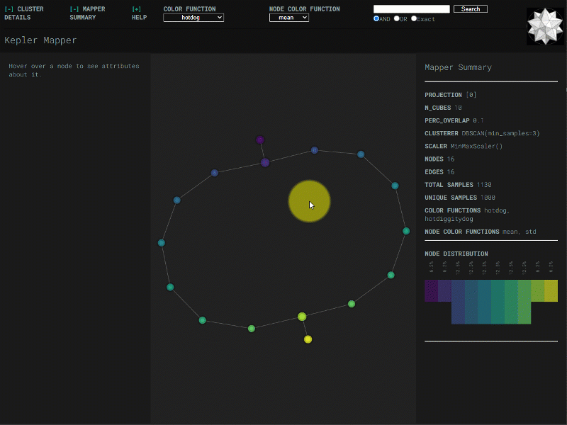
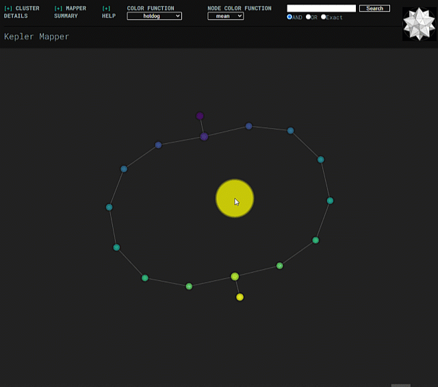
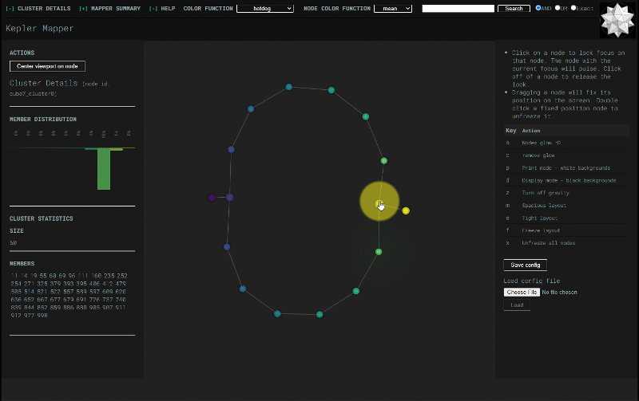

HTML Visualization Features
===========================

*Last updated 2021-10-08 with kmapper version 2.0.1*

This page demonstrates some of the options available when using
``kmapper.KeplerMapper.visualize`` to create KeplerMapper html visualizations.

.. contents:: Contents
    :local:

Colors for samples and nodes
----------------------------

A set (or sets) of ``color_values`` associate values with samples. These values
are mapped to a specified ``colorscale`` via min-max scaling. These mapped
colorvalues are used for two things on the visualization:

1.  Histogram distributions

    The "details" pane for a node displays a histogram distribution of that node's
    samples' colorvalues.

2.  Node colors

    Each node is assigned a color based on its samples' colorvalues.
    ``node_color_function`` determines the assignation function.

If more than one set of colorvalues or node color functions is specified, then
dropdowns in the visualization allow toggling between them.

Searchbar
---------

The searchbar can be used to highlight (i.e., visually resize) nodes based on
whether their samples' ``custom_tooltips`` match a query. Currently, the
searchbar can do three types of queries. See the docs for details.

Min-intersection selector
-------------------------

Min-intersection, an argument passed to ``KeplerMapper.map``, is used to determine
whether an edge should be drawn between pairs of nodes. The html visualization
can dynamically change the min-intersection it uses to draw edges. Submitting a
new value uses javascript to perform the same logic as is done in python in
``.map``. The starting value for the html visualization is the value that was
used to create the graph, which is read from metadata saved in the html file.

Lock focus on and reposition nodes
----------------------------------

Normally, nodes are free to float around the visualization, acted upon by
gravity and repulsion forces decided by the underlying d3-force simulation.
However, clicking-and-dragging a node will cause that node to become "frozen" --
it will stay where you drag it.

Individual frozen nodes can be unfrozen, and all nodes can be unfrozen (or frozen) at once:

.. image:: images/html-visualization-click-freeze-doubleclick-unfreeze.gif
  :width: 600

Nodes' positions and "frozen"-settings can saved to a ``.json`` config file. Node
positions can be loaded from that file. Useful if the ``.html`` file and the ``.json``
file to be stored and transferred in tandem, potentially for collaboration
purposes.

Light and dark modes
--------------------

The visualization can be changed to a white background which may be better for
printing.
